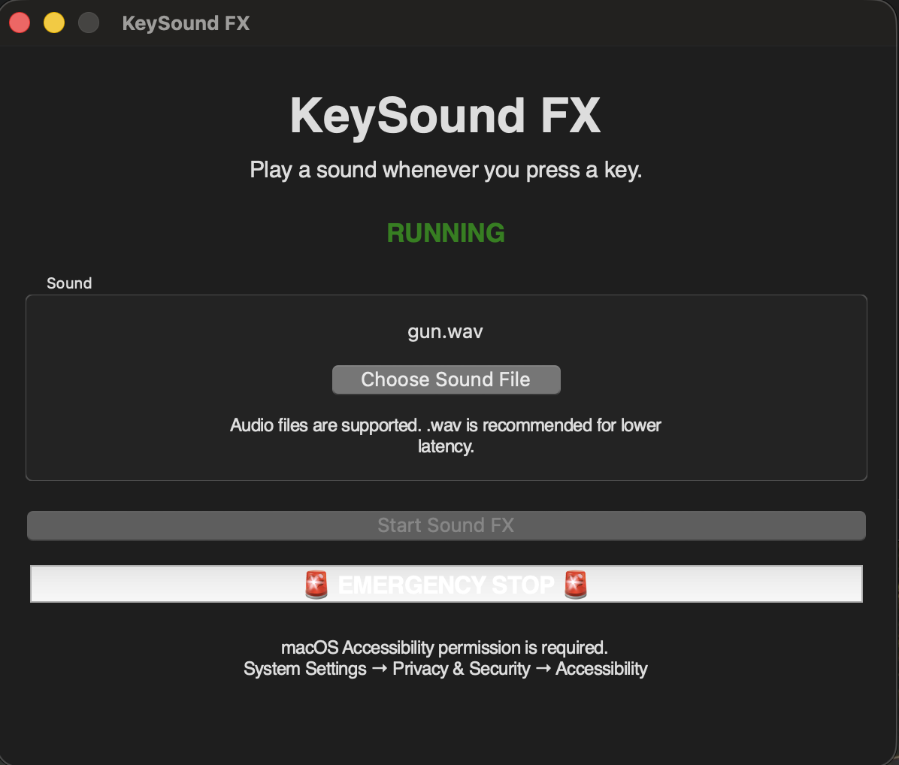

# KeySound FX

A very simple macOS desktop application that plays a sound whenever a keyboard key is pressed.

Inspired by a friend who sent me an Instagram reel of someone implementing something similar for fun.

KeySound FX uses **Apple's Quartz Event Services** to listen for keyboard events and `afplay` to play the selected audio file.

> **macOS only** — this project is specifically designed around macOS APIs and permissions.

---



##  Features

* Detects keyboard key presses using **Quartz**
* Plays a sound whenever a key is pressed
* Supports custom audio files
* Built-in file picker for choosing sounds
* `.wav` files are recommended for lower playback latency
* Emergency Stop button to immediately stop the listener and audio
* Checks for the required macOS Accessibility permission
* Simple lightweight desktop interface built with Tkinter

---

## How It Works

The application uses a relatively simple pipeline:

```text
Keyboard
   ↓
macOS Quartz Event Tap
   ↓
KeyDown Event
   ↓
Audio Playback
   ↓
Selected Sound File
```

Instead of using a cross-platform keyboard listener such as `pynput`, KeySound FX uses **Quartz directly**.

This is intentional because the application is designed specifically for macOS and needs to interact with macOS keyboard events.

The application listens for:

```text
kCGEventKeyDown
```

and plays the currently selected sound whenever a key-down event is detected.

---

## Custom Sounds

KeySound FX allows users to select their own audio file directly through the application.

Click:

```text
Choose Sound File
```

and select the audio file you want to use.

Common audio formats such as WAV, MP3, M4A, AIFF, and CAF can be selected.

### Recommended Format

**`.wav` is recommended for lower latency.**

For a keyboard sound effect, playback responsiveness is important. WAV files avoid some of the decoding overhead associated with compressed audio formats.

---

## macOS Permissions

Because KeySound FX needs to observe keyboard events, macOS requires the application to have the appropriate privacy permission.

You may need to enable:

**System Settings → Privacy & Security → Accessibility**

and allow access for the application or Python process running KeySound FX.

Without the required permission, the application will not be able to receive keyboard events.

---

## Installation

### Requirements

* macOS
* Python 3
* PyObjC
* Tkinter

Install the required macOS frameworks:

```bash
pip install pyobjc-framework-Quartz pyobjc-framework-ApplicationServices
```

The project does **not** require `pynput`.

If you previously installed it for an older version of the project, it can be removed:

```bash
pip uninstall pynput
```

---

##  Running

Clone the repository and run:

```bash
python3 ./src/app.py
```

Grant the requested macOS Accessibility permission if prompted.

Then:

1. Choose a sound file, or use the included default sound.
2. Click **Start Sound FX**.
3. Start typing.
4. The selected sound will play on each key press.
5. Use **Emergency Stop** to stop the listener and close the application.

---

## 📁 Project Structure

```text
KeySound-FX/
│
├── src/
│   └── app.py
│
├── sounds/
│   └── gun.wav
│
├── assets/
│   └── screenshot.png
│
└── README.md
```

The included `gun.wav` is simply the default sound. Users can select another audio file directly from the application.

---

## Limitations

KeySound FX is intentionally a **small and simple desktop application**, so there are several limitations.

### macOS Only

The application relies on macOS-specific APIs, particularly Quartz Event Services.

It is not currently designed to run on Windows or Linux.

### Requires Accessibility Permission

macOS privacy protections prevent applications from freely monitoring keyboard input.

The appropriate Accessibility permission must therefore be granted before the application can receive keyboard events.

### Audio Playback Is Intentionally Simple

The application currently uses macOS's `afplay` command to play sounds.

A new audio process is started for each key press.

This keeps the implementation simple, but it is not equivalent to using a dedicated low-latency audio engine.

Very rapid typing could therefore result in multiple audio processes being created at once.

### No Advanced Audio Controls

The application currently does not provide features such as:

* Volume control
* Key-specific sounds
* Sound packs
* Audio mixing
* Pitch variation
* Custom key mappings
* Background audio management
* Audio device selection

### Sound File Paths

The selected custom sound is used from its existing location rather than being imported into the application.

If the original sound file is moved or deleted, it will need to be selected again.

---

## Why Quartz?

This project originally used a cross-platform keyboard listener, but the application is specifically intended for macOS.

Using Quartz allows the project to interact directly with macOS's event system:

```text
macOS
  ↓
Quartz Event Services
  ↓
CGEventTap
  ↓
KeyDown Event
  ↓
KeySound FX
```

The event tap is created using:

```python
Quartz.CGEventTapCreate(...)
```

with:

```python
Quartz.kCGEventKeyDown
```

The application uses the event tap in **listen-only mode**, meaning it observes keyboard events rather than modifying or injecting them.

---

## Future Improvements

Some possible improvements for future versions include:

* Lower-latency audio playback
* Persistent custom sound selection
* Volume control
* Multiple sound profiles
* Different sounds for different keys
* Sound packs
* Audio preview before selecting a file
* Better error handling for unsupported audio formats
* Packaging the application as a standalone `.app`
* La
